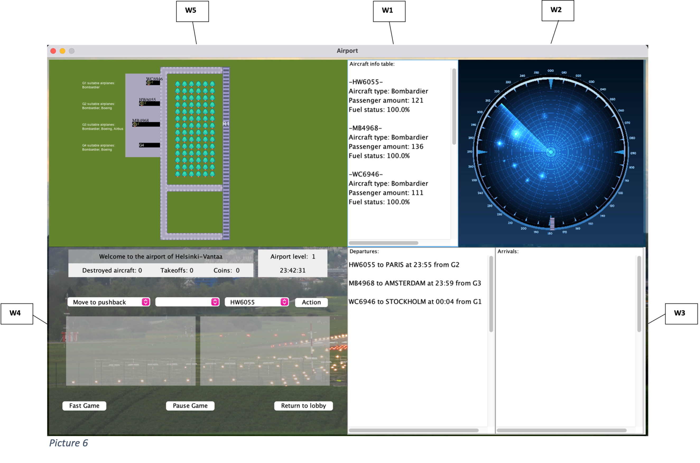
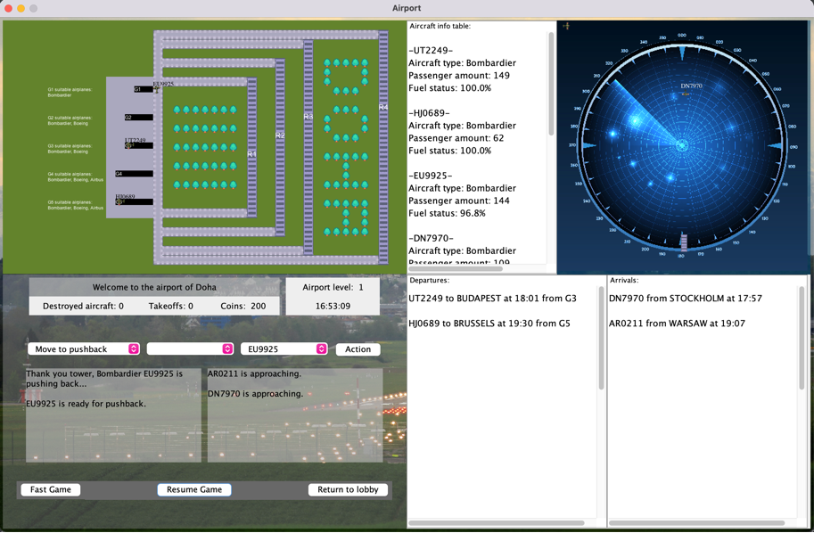

# Ohjelmointistudio_2023_74702

Programming Studio 2 project: Air traffic control game

The actual game begins running as soon as the player enters the main gaming interface. The approaching aircraft will start appearing at the radar (picture 7) moving to the south and the captains of the aircraft will begin asking to be cleared for pushback and landing (picture 8). The player must accurately time their takeoff and choose an appropriate runway for landing to prevent aircraft collisions. The player can consult the timetable (Window 3) to anticipate when the aircraft will be prepared for pushback or landing by comparing the game clock and the time of arrival or departure. If the player fails to land the aircraft, it will remain in motion on the radar until the proper command to land is issued in a timely manner (see aircraft DZ9992 and VR3665 in picture 7). Beyond avoiding collisions, players must also pay attention to aircraft fuel consumption. If the fuel level reaches zero, the aircraft will be destroyed. The aircraft’s current fuel level is displayed in Window 1. If a collision occurs or the player reaches a certain amount of aircraft destructions, the current airport level’s progress in achieved takeoffs will be reset. Furthermore, the game removes the aircraft that caused the collision and the destroyed aircraft from play. It is worth noting that the aircraft do not collide when in motion on the radar. This is because planes can fly at different altitudes.

To control air traffic, the player has a set of commands that involve selecting elements from three dropdown tables in the Window 4 (picture 9). The player selects the actual command from the leftmost dropdown table. Depending on the command selected, the middle dropdown table shows gate or runway options to which the aircraft will move. From the rightmost dropdown table, the player chooses the identifier of the aircraft to which the command is targeted. After pressing the 'Action' button, the game will process the command. The aircraft will follow the given command and move accordingly. If the command is not applicable, the captain of an aircraft will let the player know about it by displaying a notification on the output screen (picture 8). This way, the game advises the player while executing it. 

The player can advance to the next difficulty level after achieving a certain number of successful takeoffs. In addition, the game also includes a separate coin reward system that acknowledges successful consecutive takeoffs. The airport level, achieved successful takeoffs and collected coins can be seen in a separate label in Window 4 (picture 11). The game awards payers with access to more prestigious airports such as Frankfurt, Istanbul, and Doha after they collect a certain number of coins. Higher prestige airports offer more runways and gates for the player to manage (picture 10). The airports can be unlocked via the opening window provided that the player has enough coins (picture 12). The cost of an airport increases with its prestige. It is important to mention that if collisions occur or the maximum amount of destruction is reached, coins will be deducted as a penalty.

